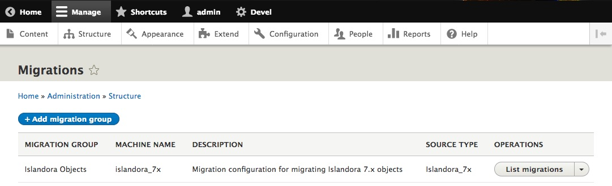
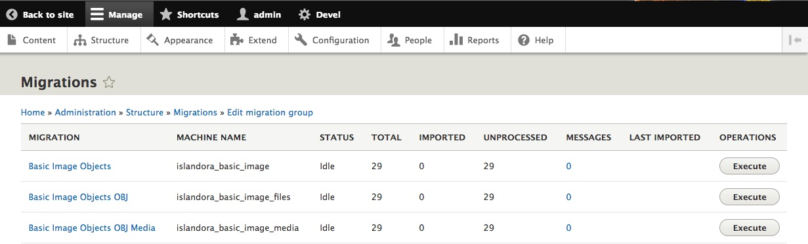
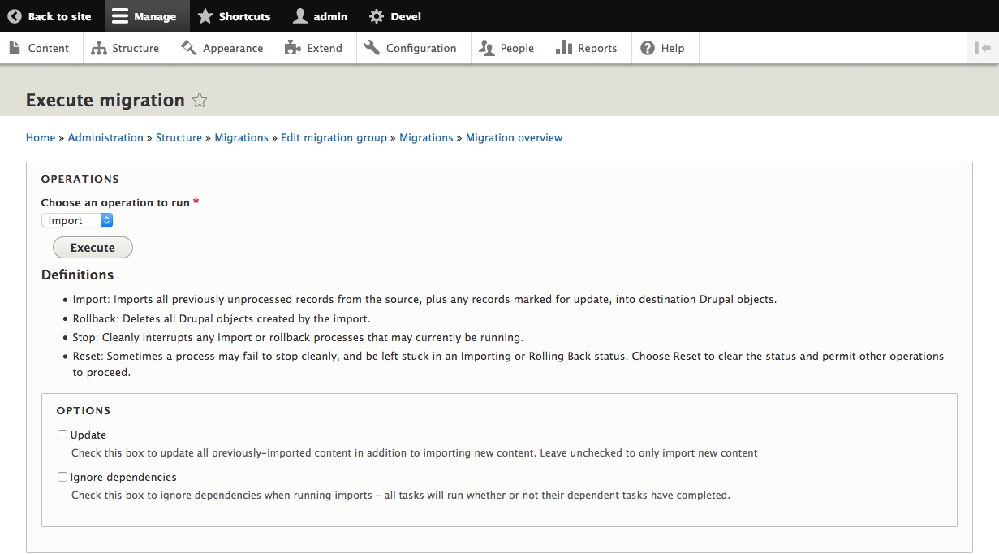
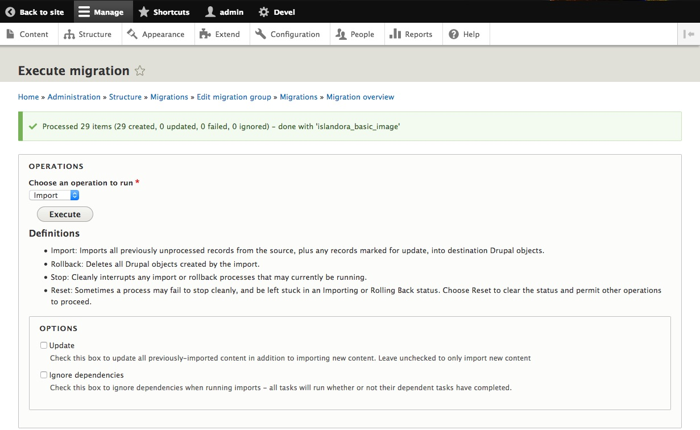

## Introduction
This module contains plugins and some example migrations to import data from a Fedora 3 Islandora instance
into an Islandora CLAW instance.

This is a base setup, it requires adjustments to the default Repository Object and configuration changes
for your setup.

## Required changes
The default Repository Object provided with Islandora CLAW requires one additional field to allow for
these migrations (or you can comment out these field migrations).

1. A large text field called `field_mods_text`, this will store the MODS datastream from the source object.

This is defined in the `config/install/migrate_plus.migration.islandora_basic_image.yml` and
can be commented out there.

## Example usage
To use this migration, clone this repo into your Drupal 8 instance `modules/contrib` directory. 

DO NOT INSTALL THE MODULE YET!!!

You will need to edit the 3 `migrate_plus.migration.islandora_basic_image*` files in the `config/install` directory.

At a minimum you'll need to set:
1. `solr_base_url: http://10.0.2.2:9080/solr` to your Solr instance
1. `fedora_base_url: &fedora_base_url http://10.0.2.2:9080/fedora` to your Fedora, please leave the `&fedora_base_url`
this is a placeholder and saves re-typing this value in other locations.
1. The `username` and `password` in the block 
   ```
    authentication: &fedora_auth
    plugin: basic
    username: fedoraAdmin
    password: fedoraAdmin
   ```

You may also need (or want) to alter the content model field name in Solr.
`content_model_field: RELS_EXT_hasModel_uri_ms`
and the content model to migrate.
`content_model: islandora:sp_basic_image`

These changes need to be made in all 3 migration configuration files.

Now you can install the `migrate_7x_claw` module.

If you have installed the `migrate_ui` module you can review the process in the `Admin -> Structure -> Migrations`.

You can then see.


If you click **List Migrations** you will see 3 migrations.



The _Basic Image Objects OBJ Media_ migration requires the other two be completed first, if you try to run this one it 
will run the other two first.

Clicking **Execute** on the _Basic Image Objects_ displays a page like.



The operations you can run are 
* **Import** - import the objects
* **Rollback** - delete all the objects (if any) previously imported
* **Stop** - stop a long running import.
* **Reset** - reset an import that might have failed.

With _Import_ selected press **Execute**.

When complete, you should see something like below (your number will be different).



Once you have completed all 3  

## How this migration works
To allow for the magic Danny content modelling overhaul.

1. The migration searches Solr for all of the content models specified.
1. Each is migrated to a new node in Drupal.
Then it creates a file for the OBJ datastream
of each of these objects. Lastly it creates a media object that links the file to the node.