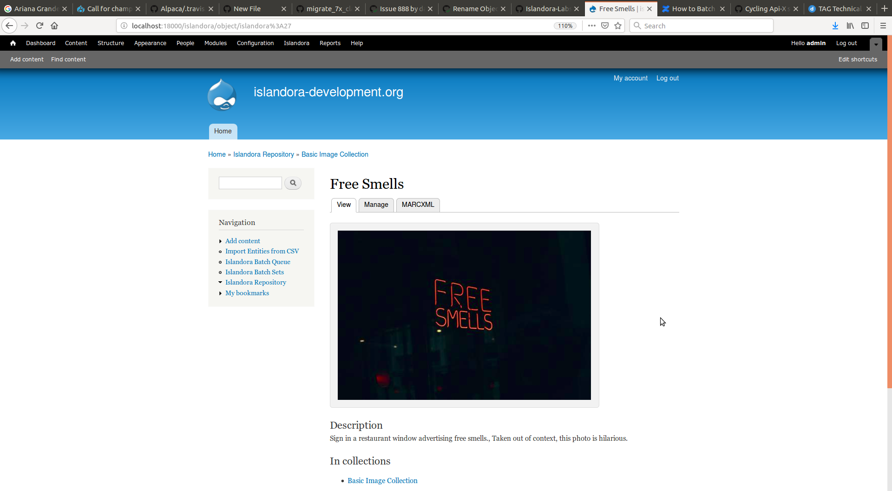
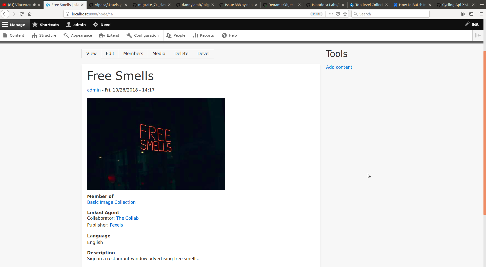
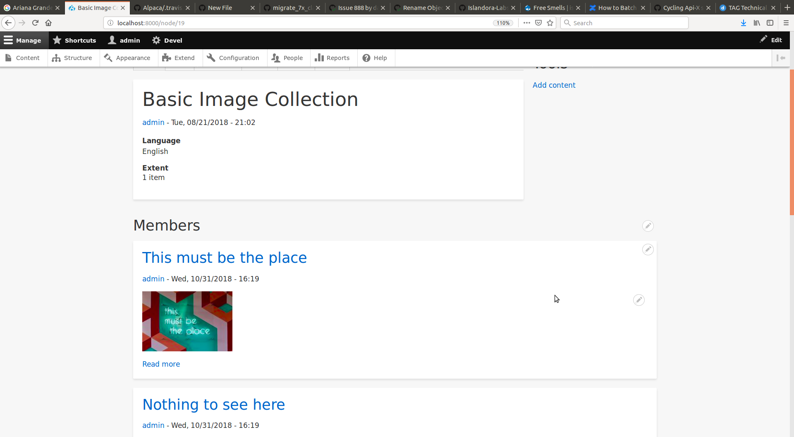

## Introduction
This module contains plugins to import data from a Fedora 3 Islandora instance
into an Islandora 8 instance. It also contains a feature as a submodule
that contains some example migrations.  The example migrations are based on forms from vanilla Islandora 7.x solution
packs, and are meant to work with the fields defined in `islandora_defaults`.  If you customized your MODS forms, then you
will also need to customize the example migration and `islandora_defaults`.

Currently, the following content models can be migrated over with full functionality:

- Collection
- Basic Image
- Large Image
- Audio
- Video
- PDF
- Binary

If you want some sample Basic Image objects with metadata made from stock forms, check out [this zip
file](docs/examples/sample_objects.zip) that you can use with `islandora_zip_batch_importer`. All the images were
obtained from [Pexels](https://www.pexels.com/) and are free to use for personal or business purposes, with the
original photographers attributed in the MODS.

## Installation

Download this module, its feature, and its dependencies with composer

```
composer require islandora/migrate_7x_claw
```

Install the module and example migrations at the same time using Drush

```
drush en islandora_migrate_7x_claw_feature
```

## Configuration

By default, the migrations are configured to work with an `islandora_vagrant` instance running on the same host as a
`claw-playbook` instance, which is convenient for development and testing. But for your Islandora 7.x instance, the
following config will need to be set the same way on the source plugin of each migration (except for the
"7.x Tags Migration from CSV" migration):

### Admin page
__/admin/config/islandora/migrate_7x_claw__


Please read the _Command Line Configuration_ section for input value descriptions and purposes. Once saved you can run the migration groups tasks (admin/structure/migrate/manage/islandora_7x/migrations)

#### Optional:
To verify saved changes go to admin/config/development/configuration/single/export
- Configuration type: migration group
- Configuration Name: Each of the following should reflect the values given.
  - migrate_plus.migration.islandora_audit_file
  - migrate_plus.migration.islandora_audit_media
  - migrate_plus.migration.islandora_corporate
  - migrate_plus.migration.islandora_files
  - migrate_plus.migration.islandora_geographic
  - migrate_plus.migration.islandora_media
  - migrate_plus.migration.islandora_objects
  - migrate_plus.migration.islandora_person
  - migrate_plus.migration.islandora_subject

### Command Line Configuration
- `solr_base_url` should point to your Islandora 7.x Solr instance (i.e. `http://example.org:8080/solr`)
- `fedora_base_url` should point to your Fedora 3 instance (i.e. `http://example.org:8080/fedora`)
- The `username` and `password` for your Fedora 3 instance in the block
   ```
    plugin: basic
    username: fedoraAdmin
    password: fedoraAdmin
   ```
- `q` is used to define a Solr query that selects which objects get migrated.  From a fresh clone, the
migrations are configured to look for `islandora:sp_basic_image_collection` and all its children with the following query:
  ```
    RELS_EXT_isMemberOfCollection_uri_ms:"info:fedora/islandora:sp_basic_image_collection" OR PID:"islandora:sp_basic_image_collection"
  ```
You can easily import a collection of your own by changing the PID in the above query, or you can provide your own
query to migrate over objects in other ways (such as per content model, in order by date created, etc...).  If you can write a Solr select query for it, you can migrate it into Islandora 8.  Omitting `q` from configuration will default to `*:*`
for the Solr query.  

Once you've updated the configuration, you need to re-import the feature to load your changes.  You can do this with `drush`:
```
drush -y fim islandora_migrate_7x_claw_feature
```

You can also use the UI to import the feature if you go to `admin/config/development/features` and click on the `Changed` link next to "Migrate 7x Claw Feature".


From there, you can select all changes and clicking "Import Changes"


## Running the migrations

You can quickly run all migrations using `drush`:
```
drush -y mim --group islandora_7x
```

If you want to go through the UI, you can visit `admin/structure/migrate` to see a list of migration groups. The migrations provided by this module have the machine name `islandora_7x`.


You will see 8 migrations. _The "7.x Tags Migration from CSV" needs to be run first_.


Clicking **Execute** on "7.x Tags Migration from CSV" migration displays a page like


The operations you can run for a migration are
* **Import** - import un-migrated objects (check the "Update" checkbox to re-run previously migrated objects)
* **Rollback** - delete all the objects (if any) previously imported
* **Stop** - stop a long running import.
* **Reset** - reset an import that might have failed.

If you select "Import", and then click "Execute", it will run the migration. It should process 5 items.

Then you can run the "Islandora Media" migration, which depends on the remaining migrations.  Running it effectively
runs the entire group of migrations other than the "7.x Tags Migration from CSV" migration.  After they're all done,
you should be able to navigate to the home page of your Islandora 8 instance and see your content brought over from
Islandora 7.x!


If you click on any node you should see all its metadata, which has been extracted from its MODS and Solr documents.
Here's the original object in Islandora 7.x:



And here it is in Islandora 8:



Clicking on the Media tab will reveal all of the datastreams migrated over from 7.x, which you can now manage through Islandora 8.  Here's the original datastreams in Islandora 7.x:


And here they are in Islandora 8 as Media:


You can also check out the collection itself, which should have its "Members" block populated:



## How this migration works
You provide a query, as `q` in the source plugin configuration, that defines which objects get migrated.  For each
result in the query, you can choose to use either the Solr doc for an object, the FOXML file for an object, or
a particular datastream for an object by setting the `url_type` configuration.  The migrations for subjects, geographics, and agents all target the MODS file of an object. The migration for datastreams uses FOXML, and the migration for the objects themselves use the Solr doc.

All datastreams are migrated over as-is, regardless of what data is extracted by the migrations and applied as fields.

Collection hierarchy is preserved so long as all the collections are in the `q` query results.

Subject, geographic, and person/corporate agents from MODS all get transformed into taxonomy terms, and content
is tagged with these terms.

## Advanced Drush commands
Useful drush commands for working with the migration process.

### Import command
This starts the import process from the command line with the username and action specified.
```shell
$ drush --uri=http://localhost:8000 --userid=1 -y migrate:import --group islandora_7x --update
        └─────────────────────────┘:└────────┘└─┘ └────────────┘ └──────────────────┘ └──────┘
URL of Islandora 8 ───┘                │       │        │                │                │
User Numeric ID  ──────────────────────┘       │        │                │                │
send yes to confirmation(optional) ────────────┘        │                │                │
Module and action ──────────────────────────────────────┘                │                │
Group name ──────────────────────────────────────────────────────────────┘                │
Update existing objects(optional) ────────────────────────────────────────────────────────┘
```

### Control the migration

```shell
$ drush migrate:rollback --update --limit="1000 items" --feedback="20 items" islandora_audit_media
        └─────┘:└──────┘ └──────┘└───────────────────┘ └───────────────────┘ └───────────────────┘
Module Name ┘      │         │           │                      │                      │
Action ────────────┘         │           │                      │                      │
confirmation(optional) ──────┘           │                      │                      │
Number of unprocessed items to run ──────┘                      │                      │
Number of items to display after completed ─────────────────────┘                      │
Migration Step ────────────────────────────────────────────────────────────────────────┘
```

__Actions:__
* import
* __rollback__
* stop
* reset

__Migrations Steps:__
* islandora_7x_tags
* islandora_audit_file
* __islandora_audit_media__
* islandora_corporate
* islandora_files
* islandora_geographic
* islandora_media
* islandora_objects
* islandora_person
* islandora_subject
